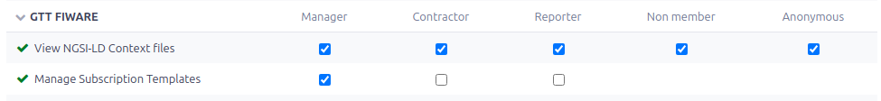

# Redmine GTT FIWARE Plugin

The Geo-Task-Tracker (GTT) FIWARE plugin adds support for [FIWARE](https://www.fiware.org/)
open standards:

- TBD

## Requirements

Redmine GTT FIWARE **requires PostgreSQL/PostGIS** and will not work with SQLite
or MariaDB/MySQL!!!

- Redmine >= 5.0.0
- [redmine_gtt](https://github.com/gtt-project/redmine_gtt/) plugin

## Installation

To install Redmine GTT FIWARE plugin, download or clone this repository in your
Redmine installation plugins directory!

```sh
cd path/to/plugin/directory
git clone https://github.com/gtt-project/redmine_gtt_fiware.git
```

Then run

```sh
bundle install
bundle exec rake redmine:plugins:migrate
```

After restarting Redmine, you should be able to see the Redmine GTT FIWARE
plugin in the Plugins page.

More information on installing (and uninstalling) Redmine plugins can be found
[here](http://www.redmine.org/wiki/redmine/Plugins).

## How to use

- Make sure REST web services is enabled: http://localhost:3000/settings?tab=api
- Enable the plugin in project settings

To allow **public** access to NGSI-LD context documents, it's necessary to grant *View*
permissions to the *Anonymous* role.



### "Context" API endpoints

| Context          | URL                                                       |
|------------------|-----------------------------------------------------------|
| General Redmine  | `http://localhost:3000/ngsi/data-models/redmine-context.jsonld` |
| GTT Redmine      | `http://localhost:3000/ngsi/data-models/redmine-gtt-context.jsonld` |
| Issues           | `http://localhost:3000/ngsi/data-models/redmine-issues-context.jsonld` |
| Projects         | `http://localhost:3000/ngsi/data-models/redmine-projects-context.jsonld` |
| Users            | `http://localhost:3000/ngsi/data-models/redmine-users-context.jsonld` |
| Versions         | `http://localhost:3000/ngsi/data-models/redmine-versions-context.jsonld` |
| Categories       | `http://localhost:3000/ngsi/data-models/redmine-categories-context.jsonld` |
| Trackers         | `http://localhost:3000/ngsi/data-models/redmine-trackers-context.jsonld` |
| Statuses         | `http://localhost:3000/ngsi/data-models/redmine-statuses.jsonld` |
| Priorities       | `http://localhost:3000/ngsi/data-models/redmine-priorities-context.jsonld` |

### NGSI-LD and NGSIv2 API endpoints

- `.json` returns NGSIv2
- `.jsonld` returns NGSI-LD (The Optional query parameter `?normalized=true|false`
  can be set to switch between normalized and not-normalized format for NGSI-LD.)

| Entity    | NGSI-LD/NGSIv2                                                 |
|-----------|----------------------------------------------------------------|
| Issue     | GET `http://localhost:3000/ngsi/issues/{id}.{jsonld,json}`     |
| Project   | GET `http://localhost:3000/ngsi/projects/{id}.{jsonld,json}`   |
| User      | GET `http://localhost:3000/ngsi/users/{id}.{jsonld,json}`      |
| Version   | GET `http://localhost:3000/ngsi/versions/{id}.{jsonld,json}`   |
| Category  | GET `http://localhost:3000/ngsi/categories/{id}.{jsonld,json}` |
| Tracker   | TBD                                                            |
| Status    | GET `http://localhost:3000/ngsi/statuses/{id}.{jsonld,json}`   |
| Priority  | GET `http://localhost:3000/ngsi/priorities/{id}.{jsonld,json}` |

## Contributing and Support

The GTT Project appreciates any [contributions](https://github.com/gtt-project/.github/blob/main/CONTRIBUTING.md)!
Feel free to contact us for [reporting problems and support](https://github.com/gtt-project/.github/blob/main/CONTRIBUTING.md).

## Version History

See [all releases](https://github.com/gtt-project/redmine_gtt_fiware/releases)
with release notes.

## Authors

- [Daniel Kastl](https://github.com/dkastl)
- ... [and others](https://github.com/gtt-project/redmine_gtt_fiware/graphs/contributors)

## LICENSE

This program is free software. See [LICENSE](LICENSE) for more information.
