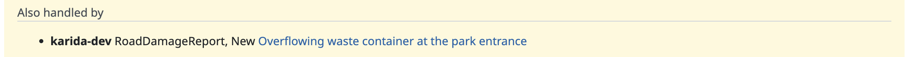

# Federation

Since version 3.1 the plugin lets organizations that share a context broker
see and react to each other's work. Two organizations work on the same problem
when their `Issue` (or `Task`) entities point at the same source entity (the
`refersTo` relationship); everything below builds on that.

Federation requires [issue emission](issue_emission.md) to be configured,
including a public host name: entities emitted without one are not visible to
other organizations' queries.

## Awareness when an issue is created

Each subscription has a **Federation** policy (Subscription options):

- **Off** (default): no federation behaviour.
- **Annotate**: the issue is created as usual, and a note lists the other
  organizations that already have a work order for the same entity, with
  status and a link into their tracker.
- **Suppress**: no issue is created while another organization has an *open*
  work order for the entity. The suppression is logged; nothing appears in the
  tracker.

## The "Also handled by" panel

Issues that came from a broker show a panel below the description listing the
other organizations' work orders for the same entity, with status and a link.
The panel loads after the page, so a slow broker never delays the issue page.
It shows only what each organization chose to publish.

## Status updates from other organizations

A subscription with **Federation watch** enabled observes other
organizations' work orders instead of creating issues: when a foreign work
order changes status, a note is added to the local issues that refer to the
same entity ("the work order by nexco-east is now Closed").

To set one up: create a subscription on an NGSI-LD connection, check *Federation
watch*, set the entity filter to type `Issue` and the watched attributes to
`status`, then publish it. The subscription's own entities never trigger notes
(they are recognized by the instance identifier in their ids), and an
unchanged status is not repeated.

## Instances with different vocabularies

An instance publishes either `Issue` entities (GTT core, the default) or
`Task` entities (the datamodels.jp task vocabulary), see
[Issue emission](issue_emission.md#the-task-vocabulary). The entity ids have
the same form in both, so organizations are recognized the same way.

- Awareness and the "Also handled by" panel find both kinds: the plugin
  sends one query per vocabulary and merges the answers. A `Task` counts as
  open while its `progress` is `needs-action` or `in-process`.
- A federation watch subscription selects one entity type with one context.
  To watch organizations that publish `Task` entities, add a second watch
  subscription: entity type `Task`, watched attribute `progress`, and
  `https://datamodels.jp/context/task/v1.jsonld` as its context. Its notes
  show the status as open or closed.

## Notes

- Sibling lookups and the panel use entity queries, which run server-side with
  the connection's stored token.
- Organizations are identified by the instance identifier in the entity id.
- Matching is by entity, not by subtype: a `RoadDamageReport` and a
  `WorkOrder` for the same entity count as the same problem, and the notes
  show the subtype so people can judge.
