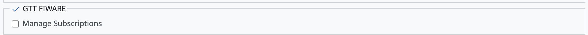

# Redmine GTT FIWARE Plugin Documentation

This documentation provides detailed instructions on how to use the Redmine GTT
FIWARE plugin and its API endpoints.

## First Steps

1. Create a [FIWARE Connection](broker_connections.md) for your context
   broker (Administration → FIWARE Connections).
2. Set **Administration → Settings → Host name** to a host the broker can
   reach: subscription callbacks are built from it.
3. Enable the **GTT FIWARE** module in a project and create a
   [subscription](subscription_template.md).
4. Optional: configure [issue emission](issue_emission.md) and
   [federation](federation.md) to publish your issues back to the broker.

Use a dedicated user with just the needed permissions as the subscription
author, not an administrator.

If you need a test broker, [FIWARE-Small-Bang](https://github.com/lets-fiware/FIWARE-Small-Bang)
(local) or [FIWARE-Big-Bang](https://github.com/lets-fiware/FIWARE-Big-Bang)
(server) set one up.

### Redmine Permissions



## How to use

- [Plugin Settings](plugin_settings.md)
- [FIWARE Connections](broker_connections.md)
- [Project Settings](project_settings.md)
- [Subscriptions](subscription_template.md)
- [Issue Emission](issue_emission.md)
- [Federation](federation.md)

## Tools and Utilities

- [FIWARE Broker Scripts](broker_scripts.md)
- [Release Verification](release_verification.md) — pre-release checks beyond
  the automated suite: auth mode drill against a fake broker, real broker
  round trips for both NGSI standards

## Reference

- [GTT FIWARE core vocabulary](https://gtt-project.org/ns/fiware) — the
  published terms used by [issue emission](issue_emission.md).
- [Historical NGSI-LD vocabulary notes](reference/ngsi-ld-vocabulary.md) —
  preserved from the removed read API; the published vocabulary above
  supersedes it.

## Examples and Tutorials

- [Temperature Sensor Example](examples/temperature_sensor.md)
- [Location Sensor Example](examples/location_sensor.md)
- [Street Camera Sensor Example](examples/camera_sensor.md)

For all examples, the following environment variables are used:

```bash
export BROKER_URL=http://your_broker:1026
export BROKER_TOKEN=your_token
export FIWARE_SERVICE=your_service
export FIWARE_SERVICEPATH=your_servicepath
```

Alternatively, you can use `.env` files to set these variables.
Copy the `.env.example` file to `.env` and set the values accordingly.
Then run `source .env` to load the environment variables.

### General FIWARE Broker Commands

#### Get Entities

```bash
curl -sX GET "${BROKER_URL}/v2/entities" \
  -H "Accept: application/json" \
  -H "Authorization: Bearer ${BROKER_TOKEN}" \
  -H "Fiware-Service: ${FIWARE_SERVICE}" \
  -H "Fiware-ServicePath: ${FIWARE_SERVICEPATH}" \
| jq
```

#### Get Subscriptions

```bash
curl -sX GET "${BROKER_URL}/v2/subscriptions" \
  -H "Accept: application/json" \
  -H "Authorization: Bearer ${BROKER_TOKEN}" \
  -H "Fiware-Service: ${FIWARE_SERVICE}" \
  -H "Fiware-ServicePath: ${FIWARE_SERVICEPATH}" \
| jq
```

### Notes

- Ensure that the FIWARE context broker is running and accessible.
- The coordinates in the location examples are in `[longitude, latitude]` format.
- The `jq` command is used to format the JSON output for better readability.

These cURL commands should help you interact with the FIWARE broker and test the
Redmine GTT FIWARE plugin effectively. If you encounter any issues or need
further assistance, please let us know!

#### CORS Issues

If you encounter CORS issues, for example when you use FIWARE-Big-Bang, you can extend
the Ngix configuration as follows:

```nginx
[snip]

server {
  [snip]

  # Add CORS Headers
  add_header 'Access-Control-Allow-Origin' '*' always;
  add_header 'Access-Control-Allow-Methods' 'GET, POST, OPTIONS, DELETE, PUT, PATCH' always;
  add_header 'Access-Control-Allow-Headers' 'Origin, Content-Type, Accept, Authorization, X-Requested-With, fiware-service, fiware-servicepath' always;
  add_header 'Access-Control-Expose-Headers' 'location, fiware-correlator' always;

  location / {
    if ($request_method = 'OPTIONS') {
      add_header 'Access-Control-Allow-Origin' '*' always;
      add_header 'Access-Control-Allow-Methods' 'GET, POST, OPTIONS, DELETE, PUT, PATCH' always;
      add_header 'Access-Control-Allow-Headers' 'Origin, Content-Type, Accept, Authorization, X-Requested-With, fiware-service, fiware-servicepath' always;
      add_header 'Access-Control-Expose-Headers' 'location, fiware-correlator' always;
      add_header 'Access-Control-Max-Age' 1728000;
      add_header 'Content-Type' 'text/plain charset=UTF-8';
      add_header 'Content-Length' 0;
      return 204;
    }

    [snip]
  }

  [snip]
}
```

In particular `location` and `fiware-service, fiware-servicepath` are important
for the FIWARE broker to work correctly.
