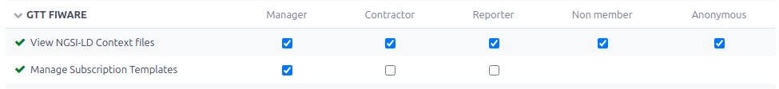

# Redmine GTT FIWARE Plugin Documentation

This documentation provides detailed instructions on how to use the Redmine GTT
FIWARE plugin and its API endpoints.

## First Steps

- Make sure REST web services is enabled: <http://localhost:3000/settings?tab=api>
- Enable the plugin in project settings
- For security reasons don't select a user with admin rights for the FIWARE
  subscriptions. Instead, create a new user with the necessary permissions.

### Redmine Permissions



To allow **public** access to NGSI-LD context documents, it's necessary to grant
*View* permissions to the *Anonymous* role.

## How to use

- [Plugin Settings](plugin_settings.md)
- [Project Settings](project_settings.md)
- [Subscription Templates](subscription_template.md)
- [API Endpoints](api_endpoints.md)

## Tools and Utilities

- [FIWARE Broker Scripts](broker_scripts.md)

## Examples and Tutorials

- [Temperature Sensor Example](temperature_sensor.md)
- [Location Sensor Example](location_sensor.md)
- [Street Camera Sensor Example](camera_sensor.md)

For all examples, the following environment variables are used:

```bash
export BROKER_URL="http://your_broker:1026"
```

Replace `your_broker_url` with the actual URL of your FIWARE broker. After
running this command, the BROKER_URL environment variable will be
available to all subsequent commands in the same terminal session.

### General FIWARE Broker Commands

#### Get Entities

```bash
curl -sX GET "${BROKER_URL}/v2/entities" -H "Accept: application/json" | jq
```

#### Get Subscriptions

```bash
curl -sX GET "${BROKER_URL}/v2/subscriptions" -H "Accept: application/json" | jq
```

### Notes

- Ensure that the FIWARE context broker is running and accessible.
- The coordinates in the location examples are in `[longitude, latitude]` format.
- The `jq` command is used to format the JSON output for better readability.

These cURL commands should help you interact with the FIWARE broker and test the
Redmine GTT FIWARE plugin effectively. If you encounter any issues or need
further assistance, please let us know!
