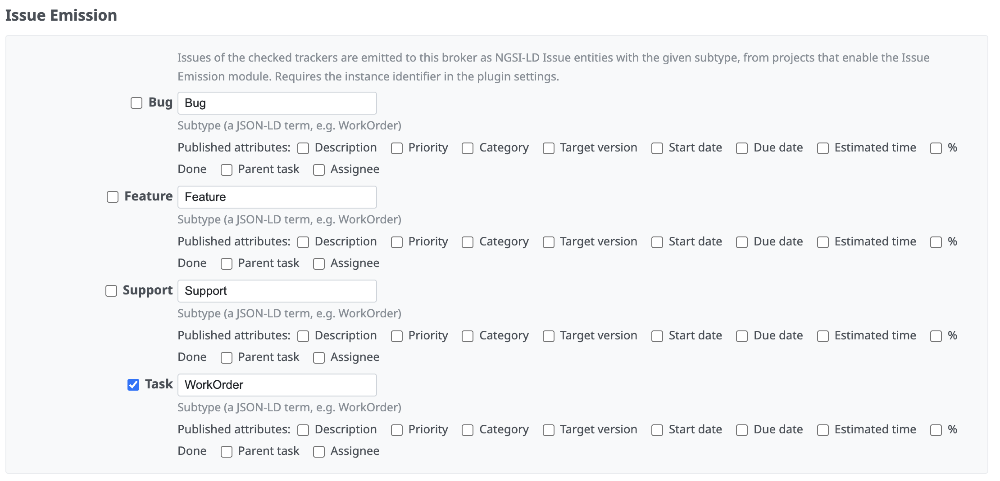

# Issue Emission

Since version 3.1 the plugin can publish issues to an NGSI-LD broker as
`Issue` entities: one entity per issue, kept up to date when the issue is
created, updated, closed or deleted. Other systems on the broker can then see
whether a problem is being handled, in what state, and where.

## Enabling emission

Three things must be configured; nothing is published until all are in place.

1. **Instance identifier** in the [plugin settings](plugin_settings.md).
2. **Tracker mapping** on an NGSI-LD [connection](broker_connections.md):
   check the trackers to emit and give each a subtype (a JSON-LD term such as
   `WorkOrder` or `RoadDamageReport`).

   
3. **Project module**: enable *GTT FIWARE Issue Emission* in the project's
   settings. Emission is a separate module from the subscriptions module on
   purpose: sharing issue data with a broker is an explicit decision.

Private issues are never emitted. If the broker is unreachable, the failure is
logged and the issue is saved normally.

## What is published

Always (the core properties):

| Property | Content |
| --- | --- |
| `title` | issue subject |
| `status` | `open` or `closed` |
| `statusLabel` | the Redmine status name |
| `subtype` | the mapped subtype for the tracker |
| `source` | the issue URL (when a host name is configured) |
| `dateCreated`, `dateModified` | timestamps |
| `location` | the issue geometry as GeoJSON, when present |
| `refersTo` | the entity that triggered the issue, when it came from a notification |

Optionally, per tracker mapping (all off by default):

- **Published attributes**: description, priority, category, target version,
  start and due date, estimated time, % done, parent (as a link to the parent
  issue's entity), assignee. Publishing the assignee's name to a shared broker
  is an explicit decision.
- **Published custom fields**: each with its own term name, typed by the
  field's format.

## Authentication

Emission runs on the server, so it can only authenticate with a connection's
*stored* token. Connections without a token emit unauthenticated, which works
for open brokers.

## Public identity and the entity id

Entity ids follow `urn:ngsi-ld:Issue:redmine:<instance-id>:<issue-id>` and
stay stable for the life of the issue.

When **Administration → Settings → Host name** is configured, emitted entities
also reference the instance's own context document (see below), so their terms
resolve through the published vocabulary. Without a host name, entities are
emitted with the NGSI-LD core context only; they are still valid, but
cross-organization queries based on the published vocabulary will not find
them. For federation, configure the host name.

## The published schema

- The core vocabulary is published at
  <https://gtt-project.org/ns/fiware>: the terms every emitting instance uses
  with the same meaning.
- Each instance serves its own context at `GET /fiware/context.jsonld`
  (public): the configured subtypes, declared as subclasses of the core
  `Issue`, and every exposed attribute term. Reading this one URL is enough to
  interpret the instance's entities.

## Issues as NGSI-LD on demand

Every issue is also available as an NGSI-LD entity at
`GET /fiware/issues/<id>/entity` (session or API key). Like emission itself,
this needs the instance identifier to be set; without it the endpoint answers
404 and the link is not shown. The issue page links to it from its
"Also available in" list, next to PDF and Atom. This returns the same
representation the emitter publishes.
