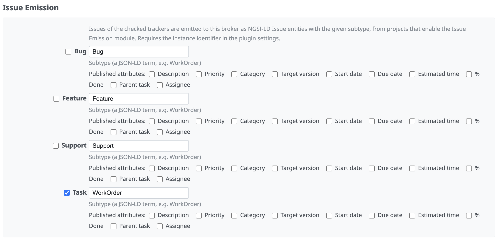

# Issue Emission

Since version 3.1 the plugin can publish issues to an NGSI-LD broker as
`Issue` entities: one entity per issue, kept up to date when the issue is
created, updated, closed or deleted. Other systems on the broker can then see
whether a problem is being handled, in what state, and where.

The entities use one of two vocabularies, chosen once for the whole instance
in the [plugin settings](plugin_settings.md):

- **GTT core** (the default): `Issue` entities in the GTT vocabulary
  (<https://gtt-project.org/ns/fiware>). Nothing changes for existing
  instances.
- **Task**: `Task` entities in the task vocabulary of the
  [datamodels.jp](https://datamodels.jp/en/models/task/Task/) catalog. Any
  NGSI-LD application written for that vocabulary can read them. See
  [The task vocabulary](#the-task-vocabulary) below.

## Enabling emission

Three things must be configured; nothing is published until all are in place.

1. **Instance identifier** in the [plugin settings](plugin_settings.md).
2. **Tracker mapping** on an NGSI-LD [connection](broker_connections.md):
   check the trackers to emit and give each a subtype (a JSON-LD term such as
   `WorkOrder` or `RoadDamageReport`).

   
3. **Project module**: enable *GTT FIWARE Issue Emission* in the project's
   settings. Emission is a separate module from the subscriptions module on
   purpose: sharing issue data with a broker is an explicit decision.

Private issues are never emitted. If the broker is unreachable, the failure is
logged and the issue is saved normally.

## What is published

This section describes the GTT core vocabulary. For the task vocabulary, see
[below](#the-task-vocabulary).

Always (the core properties):

| Property | Content |
| --- | --- |
| `title` | issue subject |
| `status` | `open` or `closed` |
| `statusLabel` | the Redmine status name |
| `subtype` | the mapped subtype for the tracker |
| `source` | the issue URL (when a host name is configured) |
| `dateCreated`, `dateModified` | timestamps |
| `location` | the issue geometry as GeoJSON, when present |
| `refersTo` | the entity that triggered the issue, when it came from a notification |

Optionally, per tracker mapping (all off by default):

- **Published attributes**: description, priority, category, target version,
  start and due date, estimated time, % done, parent (as a link to the parent
  issue's entity), assignee. Publishing the assignee's name to a shared broker
  is an explicit decision.
- **Published custom fields**: each with its own term name, typed by the
  field's format.

## Authentication

Emission runs on the server, so it can only authenticate with a connection's
*stored* token. Connections without a token emit unauthenticated, which works
for open brokers.

## Public identity and the entity id

Entity ids follow `urn:ngsi-ld:Issue:redmine:<instance-id>:<issue-id>` and
stay stable for the life of the issue. The id is the same in both
vocabularies, also for `Task` entities.

When **Administration → Settings → Host name** is configured, emitted entities
also reference the instance's own context document (see below), so their terms
resolve through the published vocabulary. Without a host name, entities are
emitted with the NGSI-LD core context only; they are still valid, but
cross-organization queries based on the published vocabulary will not find
them. For federation, configure the host name.

## The published schema

- The core vocabulary is published at
  <https://gtt-project.org/ns/fiware>: the terms every emitting instance uses
  with the same meaning.
- Each instance serves its own context at `GET /fiware/context.jsonld`
  (public): the configured subtypes, declared as subclasses of the core
  `Issue`, and every exposed attribute term. Reading this one URL is enough to
  interpret the instance's entities.
- For the task vocabulary, each instance also serves
  `GET /fiware/task-context.jsonld` (public, see below).

## The task vocabulary

With **Emission vocabulary: Task** in the plugin settings, issues are
published as `Task` entities of the datamodels.jp task vocabulary
(<https://datamodels.jp/en/models/task/Task/>). The values follow RFC 8984
(JSCalendar tasks) where the vocabulary does.

What stays the same:

- The entity id (`urn:ngsi-ld:Issue:redmine:<instance-id>:<issue-id>`).
- The tracker mappings, subtypes and the "published attributes" checkboxes.
  Each checkbox publishes the task term from the table below.
- Published custom fields: same term names, in the instance's own
  vocabulary.
- Private issues are never emitted; absent values are left out, never sent
  as empty.

### Terms

Always published:

| Redmine | GTT core | Task |
| --- | --- | --- |
| subject | `title` | `name` |
| status open / closed | `status`: `open` / `closed` | `progress`: `needs-action` / `completed` |
| status name | `statusLabel` | `statusLabel` |
| tracker mapping | `subtype` | `subtype` |
| issue URL | `source` | `source` |
| geometry | `location` | `location` |
| notification entity | `refersTo` | `refersTo` |
| created, updated | `dateCreated`, `dateModified` | `dateCreated`, `dateModified` |
| issue number | — | `externalId` (as text, for example `"42"`) |
| project | — | `project`: a Relationship to `urn:ngsi-ld:Project:redmine:<instance-id>:<project identifier>` |

Published when the checkbox is on (all off by default):

| Checkbox | GTT core | Task |
| --- | --- | --- |
| Description | `description` | `description` |
| Priority | `priority` (the name) | `priority`: a number from 1 to 9, see below |
| Category | `category` | `category` (a GTT extension term, see below) |
| Target version | `targetVersion` (the name) | `milestone`: a Relationship to `urn:ngsi-ld:Milestone:redmine:<instance-id>:<version id>` |
| Start date | `startDate` | `start` (a date) |
| Due date | `dueDate` | `due` (a date) |
| Estimated time | `estimatedTime` (hours) | `estimatedDuration`: an ISO 8601 duration, 1.5 hours → `PT1H30M` (whole minutes) |
| % Done | `percentDone` | `percentComplete` |
| Parent task | `parent` | `parent`: a Relationship to the parent issue's id |
| Assignee | `assignee` (the name) | `assignee`: a Relationship to `urn:ngsi-ld:Person:redmine:<instance-id>:<user id>`, or `urn:ngsi-ld:Group:redmine:<instance-id>:<group id>` for a group |

Details:

- **Priority**: the issue's priority is placed among the *active* Redmine
  priorities and spread evenly over 1 to 9: the highest priority is 1, the
  lowest is 9, the others in between (rounded). With Redmine's five default
  priorities: Immediate 1, Urgent 3, High 5, Normal 7, Low 9. The value is 0
  ("undefined" in RFC 8984) when there is only one active priority, or when
  the issue's priority is no longer active.
- **Assignee** is a multi-valued Relationship, so it is sent as a list with
  one entry and the `datasetId` `urn:ngsi-ld:dataset:assignee:1`. It contains
  the user's or group's id, not the name. Publishing it is still an explicit
  decision.
- **Project and milestone**: only the Relationship is published. The
  `Project` and `Milestone` entities themselves are not emitted (yet); the
  ids are stable and safe to use as keys.
- **Start and due** are plain dates (`{"@type": "Date", "@value":
  "2026-07-30"}`), as Redmine has no time of day for them.

### Contexts

- GTT publishes <https://gtt-project.org/ns/fiware-task.jsonld>. It imports
  the datamodels.jp task context
  (`https://datamodels.jp/context/task/v1.jsonld`) and adds only `category`.
- Each instance serves `GET /fiware/task-context.jsonld` (public). Its
  `@context` is that GTT context plus the instance's own terms: the subtypes
  and the published custom fields. Its `@graph` declares each subtype a
  subclass of `https://datamodels.jp/ns/task/Task`.
- `Task` entities reference the instance's task context followed by the
  NGSI-LD core context. Without a configured host name the instance context
  is out of reach, so they reference GTT's public extension context
  (`https://gtt-project.org/ns/fiware-task.jsonld`) instead; the task terms
  keep their meaning, and instance subtypes and custom fields fall back to
  the default vocabulary.
- `GET /fiware/context.jsonld` stays as it is.

### Reserved terms

In task mode a subtype or a custom field term may not be one of the task
vocabulary's terms (for example `Task`, `Project`, `Milestone`, `name`,
`progress`, `due`, `start`, `keywords`, `category`), in any upper or lower
case. The GTT reserved terms stay reserved too. Mappings saved earlier with
such a term must be renamed before the connection form can be saved again.
Until then, such a custom field is not published, and such a subtype is
still sent as the `subtype` value but is not defined in the task context.

### Switching vocabularies

- Switch in the plugin settings. Entity ids do not change.
- Entities already on a broker change on their next update: an existing
  entity of the other type is deleted and created again as the new type,
  because NGSI-LD cannot change the type of an entity in place. Issues that
  are not updated keep their old representation until then.
- Applications and subscriptions that select by type or attribute name
  (`Issue`, `title`, `status`) must be changed to the task terms (`Task`,
  `name`, `progress`).
- [Federation](federation.md) works between instances that use different
  vocabularies, with one extra watch subscription; see there.

## Issues as NGSI-LD on demand

Every issue is also available as an NGSI-LD entity at
`GET /fiware/issues/<id>/entity` (session or API key). Like emission itself,
this needs the instance identifier to be set; without it the endpoint answers
404 and the link is not shown. The issue page links to it from its
"Also available in" list, next to PDF and Atom. This returns the same
representation the emitter publishes.
