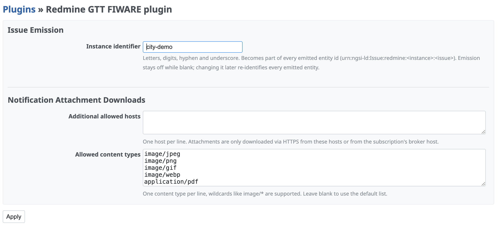

# Plugin Settings

Administration → Plugins → Redmine GTT FIWARE plugin → Configure.

Broker URLs, authentication and throttling are not configured here: they live
on [FIWARE Connections](broker_connections.md) since version 3.0.

## Issue Emission

- **Instance identifier**: letters, digits, hyphen and underscore. It becomes
  part of every emitted entity id
  (`urn:ngsi-ld:Issue:redmine:<instance>:<issue>`), so other organizations can
  tell your work orders apart from theirs. [Issue emission](issue_emission.md)
  stays off while this is blank. Choose it once and keep it: changing it later
  re-identifies every emitted entity.
- **Emission vocabulary**: the vocabulary of the emitted entities, for the
  whole instance.
  - *GTT core (Issue)*, the default: `Issue` entities in the GTT vocabulary,
    as in earlier versions.
  - *datamodels.jp task vocabulary (Task)*: `Task` entities that any
    application written for the
    [datamodels.jp task vocabulary](https://datamodels.jp/en/models/task/Task/)
    can read.

  Entity ids are the same in both, so you can switch later. Entities already
  on a broker are replaced on their next update. The terms of each
  vocabulary are listed in [Issue emission](issue_emission.md#the-task-vocabulary).

## Notification Attachment Downloads

Attachments referenced in broker notifications are downloaded over HTTPS only,
from an allowlist of hosts.

- **Additional allowed hosts**: one host per line. The subscription's
  broker host is always allowed.
- **Allowed content types**: one content type per line; wildcards like
  `image/*` are supported. Leave blank for the default list (common image
  formats, PDF, plain text, CSV, JSON).
