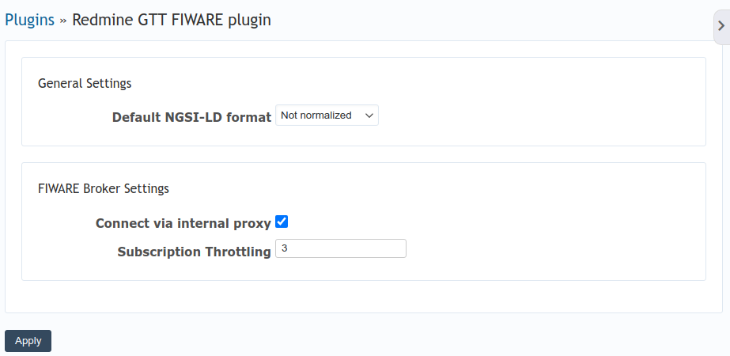

# Redmine GTT FIWARE Plugin Settings

This page provides an overview of the settings available for the Redmine GTT
FIWARE plugin. The plugin is designed to manage subscriptions for a FIWARE
context broker, allowing the creation of Redmine issues through FIWARE
notifications.

## General Settings

### Default NGSI-LD Format

- **Description**: Specifies the format of the NGSI-LD data.
- **Options**:
  - **Not normalized**: The data is not converted to a normalized format.
  - **Normalized**: The data is converted to a normalized format.

## FIWARE Broker Settings

### Subscription Throttling

- **Description**: Limits the number of subscription notifications per second.
- **Default**: 10

## Applying Settings

After configuring the settings, click the **Apply** button to save your changes.
