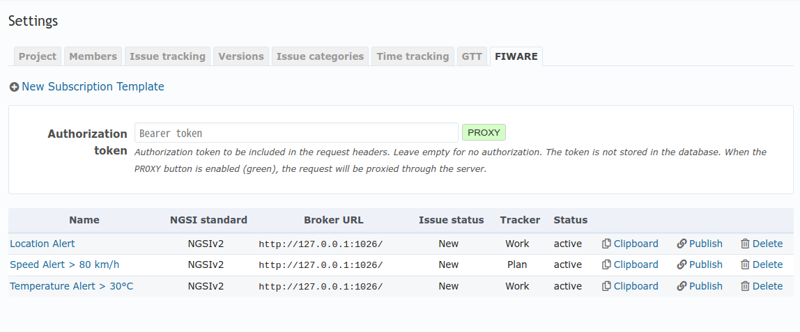

# Project Settings

## Enabling the Plugin for a Project

To use the plugin, it needs to be enabled for each project. Once enabled,
a **FIWARE** tab will appear in the project settings.

1. Go to the project where you want to enable the plugin.
2. Navigate to **Settings**.
3. Click on the **Modules** tab.
4. Check the **GTT FIWARE** module to enable it.
5. Click **Save**.

## FIWARE Tab in Project Settings

After enabling the plugin for the project, the **FIWARE** tab will appear in the
project settings. This tab allows you to create and manage subscription templates.

### Creating a New Subscription Template

TBD

### Managing Subscription Templates

In the **FIWARE** tab, you can view, edit, and delete existing subscription
templates. You can also copy the template settings to the clipboard or (un)publish
a template if needed.
