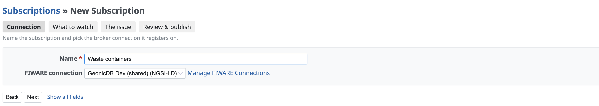
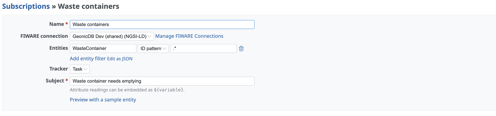
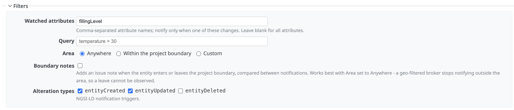
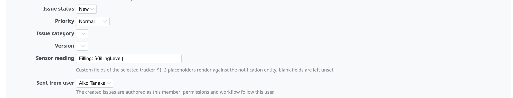
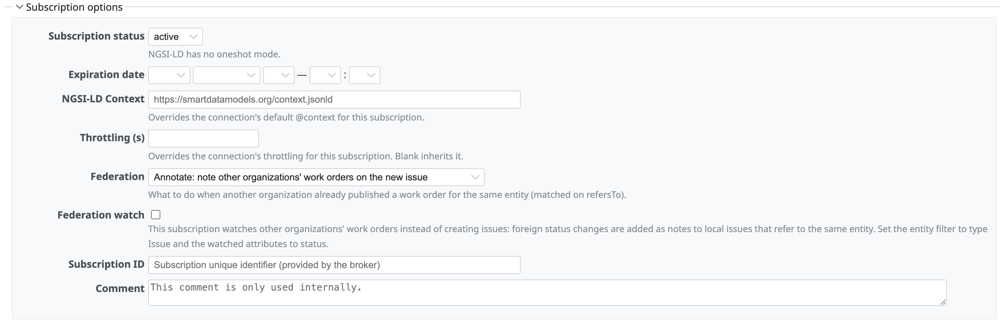

# Subscriptions

A subscription tells a context broker which entity changes to send to Redmine,
and how to turn each notification into an issue. Subscriptions are managed per
project: project → Settings → FIWARE → **New Subscription**.

Creating one is guided: the form opens as a four-step flow that asks for the
connection, what to watch, the issue to create, and finally previews and
publishes. **Show all fields** leaves the guide and shows the whole form,
which is also what editing an existing subscription gives you. Nothing is
lost when switching: it is one form throughout, and the guide only chooses
what to show.

In the full form the essential fields come first and everything else lives in
three collapsible sections. A new subscription is publishable with just the
visible fields.

## Basics

- **Name** (required).
- **FIWARE connection** (required): the broker to subscribe on; see
  [FIWARE Connections](broker_connections.md). The form adapts to the
  connection's NGSI standard, and fields that do not apply are hidden.
- **Entities**: which entity types (and optionally id patterns or exact ids)
  the subscription covers. The rows can also be edited as raw JSON.
- **Tracker** and **Subject** (required): the issue defaults. Attribute
  readings can be embedded anywhere in the issue texts as `${...}`
  placeholders, for example `${id}`, `${type}`, `${temperature}` or
  `${attrs.temperature.value}`.
- **Preview with a sample entity**: renders the subject and description
  against a real entity fetched from the broker, before anything is saved or
  published.

## Filters

- **Watched attributes**: notify only when one of these attributes changes.
- **Query**: an attribute condition, for example `severity>3`.
- **Area**: no geographic filter, the project boundary, or a custom
  georel/geometry/coordinates triple.
- **Boundary notes**: adds an issue note when the entity enters or leaves the
  project boundary. The crossing is detected between notifications, by
  comparing the issue's stored position with the new one, so it needs the GTT
  module and a project boundary. Keep **Area** on *Anywhere* when using it: a
  broker that filters geographically simply stops notifying once the entity is
  outside the area, and a departure can then never be observed.
- **Alteration types** and **Notify on metadata change**: which kinds of
  entity changes notify (the options follow the connection's NGSI standard).

## Issue details

The fields follow the selected tracker: fields the tracker disables are
hidden, the status list offers what the tracker's workflow allows for the
*Sent from user* member, and the tracker's own custom fields appear.

- **Description** and **Issue notes** templates (`${...}` placeholders work
  here too). The notes template is used when a notification updates an
  existing issue instead of creating a new one.
- **Threshold (h)**: within this window, repeated notifications for the same
  entity update the first issue (adding the notes) instead of creating
  duplicates. `0` creates a new issue every time.
- **Issue geometry**: the entity's location, a custom GeoJSON template, or
  none. New subscriptions default to the entity's location.
- **Attachments**: URLs (with `${...}` placeholders) downloaded and attached
  to the issue; see the allowlist in the
  [plugin settings](plugin_settings.md).
- **Issue status, priority, category, version**: the created issue's fields.
  The status list is reduced to the workflow's new-issue transitions for the
  member's roles; a stored status the workflow no longer offers is kept rather
  than silently changed.
- **Custom fields**: the selected tracker's custom fields, each a template
  (`${...}` placeholders included), so a reading can land in a typed field.
  Blank fields are left unset, and values are applied with the member's field
  permissions.

  

- **Sent from user** (required): the member the issues are authored as. It
  decides the author, the permissions the issue is created with, and the
  workflow statuses offered above, so use a dedicated user with just the
  needed permissions, not an administrator.

## Subscription options

- **Subscription status**: active, inactive or oneshot (oneshot is NGSIv2
  only).
- **Expiration date**.
- **NGSI-LD Context**: overrides the connection's default `@context`.
- **Federation** and **Federation watch**: see [Federation](federation.md).
- **Throttling (s)**: overrides the connection's throttling.
- **Subscription ID**: set automatically when publishing; shown for
  reference.

## Publishing

Publish from the FIWARE tab (or directly with **Create and publish** for
connections with a stored token). The broker then confirms the subscription
and its id is stored. **Synchronize** re-reads the subscription's state from
the broker; **Unpublish** removes it.

The notification endpoint that receives the broker's callbacks is
authenticated by a per-subscription secret, generated automatically and
included when publishing. Callback URLs are built from
**Administration → Settings → Host name**, so make sure it is set to a host
the broker can reach.
