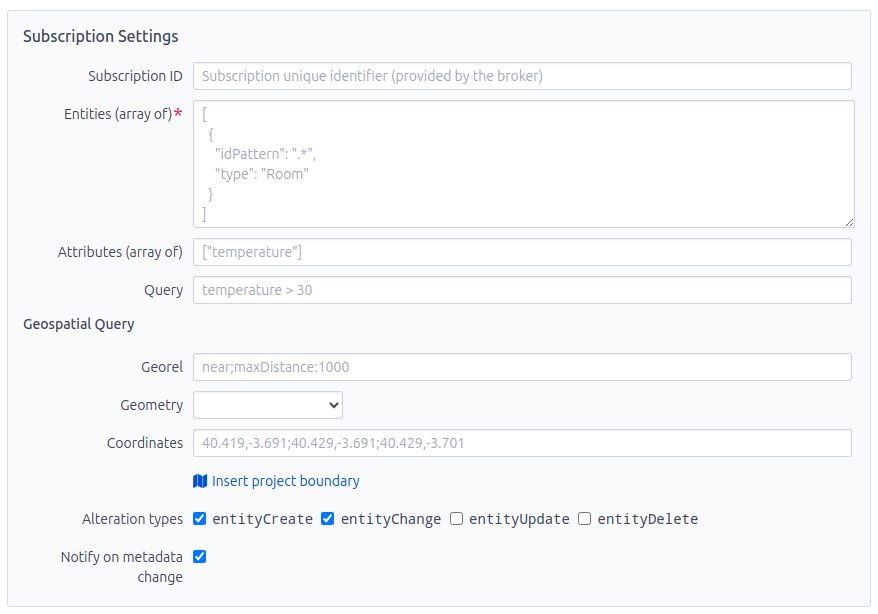

# Subscription Templates

This section provides detailed instructions on how to create or edit a
subscription template in the Redmine GTT FIWARE plugin. Subscription templates
allow you to define how FIWARE notifications should be handled and converted
into Redmine issues.

## Accessing the Subscription Template Page

1. Navigate to the project where you want to create or edit a subscription template.
2. Go to **Settings**.
3. Click on the **FIWARE** tab.
4. Click on **New Subscription Template** or select an existing template to edit.

## General Settings

In the **General** section, you can configure the basic details of the
subscription template.


- **NGSI standard**: Select the NGSI standard to be used (defaults to *NGSIv2*).
- **Name** (required): Enter a descriptive name for the subscription template.
- **Broker URL** (required): Specify the URL of the FIWARE context broker.
- **Status** (required): Set the status of the subscription (*active*,
  *inactive* or *oneshot*,).
- **FIWARE Service** (optional): Define the FIWARE service.
- **FIWARE Service Path** (optional): Specify the FIWARE service path.
- **Expiration date** (optional): Set the expiration date for the subscription.
- **Comment** (optional): Add any additional comments about the subscription template.

## Subscription Settings

In the **Subscription Settings** section, you can define the specifics of the
subscription, including entities, attributes, and (geospatial) queries.



- **Subscription ID**: (Read-only) The unique identifier for the subscription,
  provided by the broker and automatically set when publishing through the plugin.
- **Entities (array of)** (required): Define the entities that the subscription
  applies to; Must be a valid JSON array of objects, for example:

  ```json
  [
    {
      "idPattern": ".*",
      "type": "Room"
    }
  ]
  ```

- **Attributes (array of)**: List the attributes that will trigger notifications
  (e.g., `["temperature"]`). If left empty, all attributes will be considered.
- **Query**: Specify the query condition (e.g., `temperature > 30`).
- **Geospatial Query**: Define the geospatial query parameters. You must privide
  all or none of the following fields:
  - **Georel**: Set the geospatial relationship (e.g., `near;maxDistance:1000`).
  - **Geometry**: Choose the geometry type (e.g., `Point`).
  - **Coordinates**: Enter the coordinates (`latitude`,
    `longitude`) for the geospatial query (e.g. `34.751,135.22;34.67,135.221;34.671,135.345;34.752,135.344;34.751,135.22`).
  - **Insert project boundary**: Automatically insert the project boundary as
    valid geospatial query.

- **Alteration types**: Select the types of alterations that will trigger
  notifications (e.g., `entityCreate`, `entityChange`, `entityUpdate`, `entityDelete`).
- **Notify on metadata change**: Check if you want to receive notifications on
  metadata changes (defaults to `true`).

## Issue Template

In the **Issue Template** section, you can define how the Redmine issue should
be created or updated based on the subscription notifications.


- **Tracker**: Select the tracker for the issue (e.g., *Work*).
- **Subject**: Define the subject of the issue. You can embed attribute readings
  using `${variable}`, for example:

  ```text
  Temperature Alert in ${Room}
  ```

- **Description**: Provide the description for the issue. You can embed
  attribute readings using `${variable}`, for example:

  ```markdown
  The sensor in room ${Room} recorded a temperature of ${temperature}°C.
  - [ ] Open window
  - [ ] Turn on the air conditioning
  ```

- **Notes**: Configure to post an issue note instead of creating a new issue if
  an issue has been created within the threshold. You can embed attribute
  readings using `${variable}`.
- **Threshold (h)**: Set the threshold to create a new issue in hours. Subsequent
  notifications will be added as notes to the existing issue if the threshold
  has not been exceeded. Set to `0` to always create a new issue.
- **Issue geometry (GeoJSON)** (optional): Define the issue geometry using
  GeoJSON. You can embed attribute readings using `${variable}`, for example:

  ```json
  {
    "type": "Feature",
    "geometry": "${location}"
  }
  ```

  You must use quotes around the `${variable}` to ensure the GeoJSON is valid!

- **Attachments (array of)** (optional): List any attachments to be included in
  the issue. You must provide a valid JSON array of objects. Each object must
  have the `url` field set to the URL of the attachment, and optionally the
  `filename` and `description` fields. You may embed attribute readings using
  `${variable}`, for example:

  ```json
  [
    {
      "filename": "image.jpg",
      "description": "Image of the room",
      "url": "${image_url}"
    }
  ]
  ```

- **Issue status**: Set the status of the issue (e.g., *New*).
- **Priority**: Define the priority of the issue (e.g., *Normal*).
- **Issue category**: Select the issue category. Categories can be created in
  the project settings.
- **Version**: Specify the version. Versions can be created in the project settings.
- **Sent from user**: Select the user from whom the issue is sent. The user must
  have the necessary permissions to create issues in this project. However, **for
  security reasons the user should not have administrator rights**, because its
  API key is stored in the subscription template.
- **Private**: Check if the issue should be marked *private*.

## Applying Settings

After configuring all the sections, click the **Create** button to save the new
subscription template or **Create and add another** to save and create another template.
